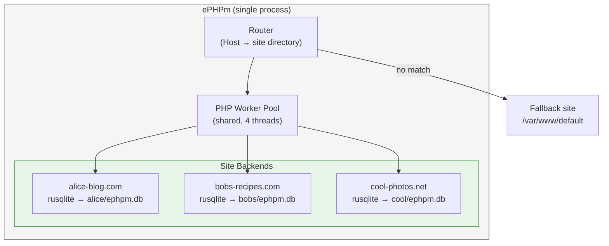

# Virtual Hosts

ePHPm supports multi-tenant hosting through directory-based virtual hosts. Each domain gets its own document root and SQLite database. No per-site configuration files needed — the directory structure IS the config.

## How It Works

```toml
[server]
listen = "0.0.0.0:8080"
document_root = "/var/www/default"   # fallback site (optional)
sites_dir = "/var/www/sites"         # vhost directory
```

When a request comes in, ePHPm matches the `Host` header against directories in `sites_dir`:

```
Request: Host: alice-blog.com
  → Look for /var/www/sites/alice-blog.com/
  → Found? Serve from that directory with its own SQLite database
  → Not found? Fall back to server.document_root (or 404 if not configured)
```

### Directory Convention

```
/var/www/
  default/                        # fallback site (marketing, signup page)
    index.php
    wp-content/
  sites/
    alice-blog.com/               # docroot for alice-blog.com
      index.php
      wp-content/
      ephpm.db                    # auto-created SQLite database
    bobs-recipes.com/             # docroot for bobs-recipes.com
      index.php
      wp-content/
      ephpm.db
    cool-photos.net/              # docroot for cool-photos.net
      index.php
      wp-content/
      ephpm.db
```

Adding a site: create a directory named after the domain, drop WordPress in it.
Removing a site: delete the directory. Requests to that domain hit the fallback.

### Per-Site Overrides

Most sites need zero configuration — they inherit PHP settings, timeouts, and security rules from the global config. If a site needs custom settings, drop a `site.toml` in its directory:

```
/var/www/sites/alice-blog.com/
  site.toml                       # optional overrides
  index.php
  ephpm.db
```

```toml
# site.toml — only set what you want to override
[php]
memory_limit = "256M"             # this site needs more memory

[db.sqlite]
path = "/mnt/fast-ssd/alice.db"   # custom database location
```

Everything not specified in `site.toml` falls through to the global `ephpm.toml`.

### SQLite Database Location

By default, the SQLite database is created as `ephpm.db` inside the site's directory. This keeps everything self-contained — a site is one directory with code and data together.

Override with `db.sqlite.path` in `site.toml` if you need the database on a different volume (e.g., fast SSD for the database, cheap storage for uploads).

### Host Matching

| Request Host | Directory checked | Result |
|-------------|-------------------|--------|
| `alice-blog.com` | `/var/www/sites/alice-blog.com/` | Serve from site directory |
| `www.alice-blog.com` | `/var/www/sites/www.alice-blog.com/` | Serve if exists, else fallback |
| `unknown.com` | `/var/www/sites/unknown.com/` | Not found → fallback to `document_root` |
| No Host header | — | Fallback to `document_root` |

Port numbers and trailing dots are stripped before matching. The match is exact — no wildcard or regex patterns. For `www.` handling, either create a symlink or handle the redirect in your fallback site.

## Architecture

### Single Process, Shared Workers

All sites share one ephpm process and one PHP worker pool. A request to `alice-blog.com` and a request to `bobs-recipes.com` are handled by the same workers — the router sets the correct document root and database before dispatching to PHP.



This is efficient — 20 sites don't need 20x the workers. PHP workers are fungible; any worker can serve any site.

### Per-Site litewire Instances

Each site gets its own litewire MySQL frontend and rusqlite backend. The frontends share a port range or use the site's `Host` header for routing (since MySQL wire protocol doesn't carry Host, each site that needs MySQL wire access gets its own port, or all sites share one litewire instance that routes by the current request context).

For most WordPress setups, PHP connects to litewire on `127.0.0.1:3306`. The router injects the correct `DB_HOST`, `DB_PORT`, and database path per site before PHP executes.

## Resource Usage

### Memory (single-node, all sites share workers)

| Sites | Typical memory | Notes |
|-------|---------------|-------|
| 1 | ~270 MB | Baseline (4 workers) |
| 5 | ~300 MB | +~6 MB per SQLite database loaded |
| 10 | ~330 MB | SQLite only loads when queried |
| 20 | ~390 MB | Idle sites use near-zero extra memory |

SQLite databases are opened on demand. An idle site with no recent traffic has minimal memory footprint — just the file handle. The PHP worker pool doesn't grow with site count.

### CPU

Shared across all sites. A 2 vCPU machine handles ~20-40 total req/s across all sites combined, regardless of how many sites exist. Individual site throughput depends on how the traffic is distributed.

### Disk

| Component | Per site |
|-----------|----------|
| WordPress installation | 60-80 MB |
| SQLite database (typical blog) | 10-100 MB |
| Uploads (images, media) | Varies |

20 WordPress sites fit comfortably on a 40 GB SSD.

## Clustered Mode with Virtual Hosts

Virtual hosts work with clustered SQLite, but each site spawns its own sqld child process for replication. This adds ~40-50 MB memory per site.

| Sites (clustered) | sqld processes | Extra memory |
|-------------------|---------------|-------------|
| 1 | 1 | ~40 MB |
| 3 | 3 | ~120 MB |
| 5 | 5 | ~200 MB |
| 10+ | 10+ | Not recommended |

**Recommendation:** Use single-node SQLite for multi-tenant hosting. Back up with volume snapshots or Litestream. If specific sites need HA, consider:

- Promote just those sites to clustered mode (per-site `site.toml` override)
- Move high-traffic sites to an external MySQL via the DB proxy
- Run a separate ephpm instance for clustered sites

Beyond 3-5 clustered vhosts, an external MySQL server with ePHPm's connection-pooling DB proxy is more resource-efficient than per-site sqld processes.

## Fallback Site as Marketing Funnel

The fallback `document_root` serves requests for any domain not matched by `sites_dir`. This is useful for hosting businesses:

```
/var/www/default/
  index.php    → "Start your blog today! Sign up at hosting.example.com"
```

When a customer cancels and their site directory is removed, traffic from existing backlinks, bookmarks, and search engine rankings flows to your marketing page instead of a dead 404. Free inbound traffic to your signup funnel.

### Lifecycle

```
1. Customer signs up for alice-blog.com
   → Create /var/www/sites/alice-blog.com/
   → Install WordPress
   → Site is live immediately (no restart needed with future hot-reload)

2. Customer is active
   → Requests to alice-blog.com served from site directory
   → SQLite database grows organically

3. Customer cancels
   → Archive /var/www/sites/alice-blog.com/ (backup the .db file)
   → Delete directory
   → Traffic to alice-blog.com hits fallback marketing page

4. Domain expires / new customer
   → Create directory again for new owner
   → Fresh WordPress install
```

## Configuration Reference

```toml
[server]
listen = "0.0.0.0:8080"

# Fallback document root for unmatched Host headers.
# Omit to return 404 for unknown domains.
document_root = "/var/www/default"

# Virtual host directory. Each subdirectory is named after a domain.
# Omit to disable vhosting (single-site mode).
sites_dir = "/var/www/sites"

# Global PHP settings (inherited by all sites unless overridden)
[php]
workers = 4
memory_limit = "128M"

# Global SQLite defaults (inherited by all sites)
[db.sqlite.proxy]
mysql_listen = "127.0.0.1:3306"
```

Environment variable overrides:

```bash
EPHPM_SERVER__SITES_DIR=/var/www/sites
EPHPM_SERVER__DOCUMENT_ROOT=/var/www/default
```

## Deployment Example: 20-Blog Hosting on Hetzner CAX11

**VM:** Hetzner CAX11 — 2 ARM vCPUs, 4 GB RAM, 40 GB SSD — $3.69/mo

```toml
[server]
listen = "0.0.0.0:8080"
document_root = "/var/www/marketing"
sites_dir = "/var/www/sites"

[php]
workers = 4
memory_limit = "64M"

[kv]
memory_limit = "64MB"
```

Put a reverse proxy (Caddy recommended — automatic HTTPS per domain) in front for TLS termination, or use ePHPm's built-in ACME with a wildcard cert.

**Capacity:**
- 20 WordPress blogs
- ~390 MB memory used
- ~20-40 req/s total throughput
- $0.18/mo per site
- Zero ops: one binary, one config file, automated backups via Hetzner snapshots

## Implementation Status

Virtual host support is **not yet implemented**. The design is documented here for future implementation. The key changes needed:

1. **Config:** Add `sites_dir` field to `ServerConfig`
2. **Router:** Match `Host` header against `sites_dir` subdirectories
3. **Per-site state:** Lazy-initialize litewire/rusqlite backends per site on first request
4. **Per-site overrides:** Load `site.toml` from site directory, merge with global config
5. **Environment injection:** Set `DB_HOST`/`DB_PORT`/database path per site before PHP dispatch
