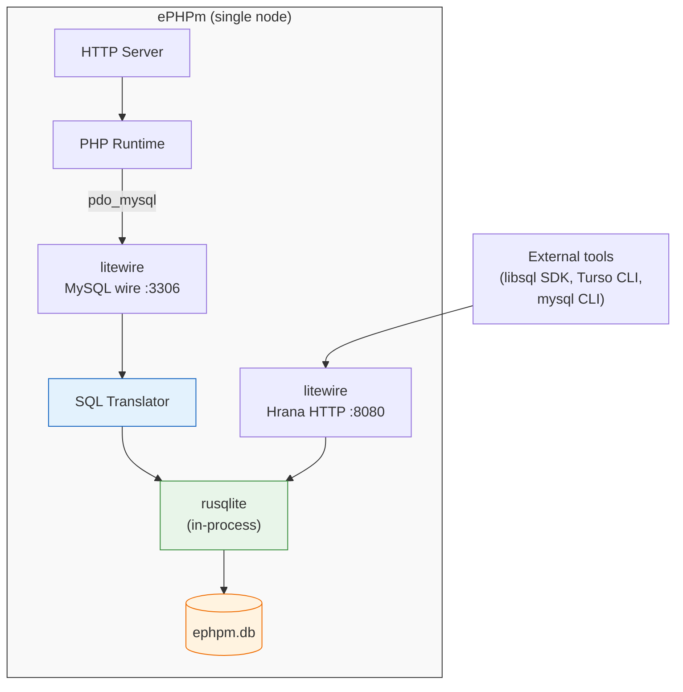
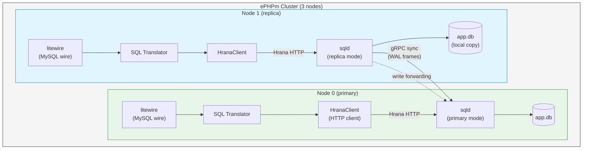

+++
title = "Database"
type = "docs"
weight = 4
+++

ePHPm bundles an embedded SQLite database for zero-dependency deployments. PHP apps connect using their existing `pdo_mysql` drivers — backed by the same in-process SQLite engine. No code changes, no external database server.

The protocol translation layer is provided by [litewire](https://github.com/ephpm/litewire), a standalone Rust project that translates MySQL, PostgreSQL, and SQL Server wire protocols to SQLite.

## Why SQLite

The primary use case is single-node deployments where running a separate MySQL or PostgreSQL server is overkill:

- **CI/CD and preview environments** — spin up a full app stack with one binary, tear it down when done
- **Edge/single-server deployments** — VPS, bare metal, IoT, kiosk
- **Development** — no Docker Compose, no database container, just `ephpm serve`
- **Small production sites** — blogs, landing pages, internal tools that don't need a database cluster

WordPress and Laravel both support SQLite natively. The ephpm binary ships with SQLite compiled in — PHP's existing MySQL drivers connect to it transparently through litewire's protocol translation.

## Two Modes of Operation

ePHPm operates in two modes depending on whether clustering is enabled. The key difference is the SQLite backend: in-process rusqlite for single-node, or sqld child process for clustered replication.

### Single-Node (CI / Dev / Small Production)

No sqld, no child processes. litewire runs entirely in-process with a rusqlite backend. This is the lightest possible deployment — just ephpm and a `.db` file.



Configuration:

```toml
[db.sqlite]
path = "ephpm.db"

[db.sqlite.proxy]
mysql_listen = "127.0.0.1:3306"
hrana_listen = "127.0.0.1:8080"  # optional
```

### Clustered (3-Node HA)

sqld (libsql-server) is spawned as a child process on each node for replication support. litewire's wire protocol frontends still handle PHP connections, but the backend switches to an HTTP/Hrana client talking to the local sqld instance.

sqld v0.24.32 is embedded in the ephpm binary via `include_bytes!()` — no separate install needed. At startup, ephpm extracts it to a temp path and spawns it as a child process.



Configuration:

```toml
[db.sqlite]
path = "/var/lib/ephpm/app.db"

[db.sqlite.proxy]
mysql_listen = "127.0.0.1:3306"

[db.sqlite.sqld]
http_listen = "127.0.0.1:8081"    # internal: litewire -> sqld
grpc_listen = "0.0.0.0:5001"     # inter-node replication

[db.sqlite.replication]
role = "auto"                     # elected via gossip

[cluster]
enabled = true
bind = "0.0.0.0:7946"
join = ["ephpm-headless.default.svc.cluster.local"]
```

## Implementation Status

| Component | Status | Crate |
|-----------|--------|-------|
| MySQL wire protocol frontend | **Implemented** | `litewire-mysql` (opensrv-mysql) |
| Hrana HTTP frontend | **Implemented** | `litewire-hrana` (axum) |
| SQL dialect translation (MySQL → SQLite) | **Implemented** | `litewire-translate` (sqlparser-rs) |
| rusqlite backend (in-process) | **Implemented** | `litewire-backend` |
| HranaClient backend (HTTP to sqld) | **Implemented** | `litewire-backend` (reqwest) |
| sqld binary embedding + process manager | **Implemented** | `ephpm-sqld` |
| Primary election via gossip KV | **Implemented** | `ephpm-cluster` (sqlite_election) |
| Failover restart (role change → sqld restart) | **Implemented** | `ephpm-server` |
| sqld auto-download in release build | **Implemented** | `xtask` (v0.24.32 pinned) |
| PostgreSQL wire protocol frontend | Placeholder | `litewire-postgres` (pgwire) |
| TDS (SQL Server) wire protocol frontend | Placeholder | `litewire-tds` |
| Windows clustered mode | Not supported | sqld has no Windows binary |

## litewire: Protocol Translation Layer

[litewire](https://github.com/ephpm/litewire) is a standalone open-source Rust project that provides MySQL, PostgreSQL, SQL Server, and Hrana protocol frontends backed by SQLite. ePHPm uses it as a library dependency.

### SQL Translation

litewire uses `sqlparser-rs` to parse MySQL into an AST, then rewrites dialect-specific constructs to SQLite equivalents:

| MySQL | SQLite |
|-------|--------|
| `AUTO_INCREMENT` | `INTEGER PRIMARY KEY AUTOINCREMENT` |
| `NOW()` | `datetime('now')` |
| `ON DUPLICATE KEY UPDATE` | `ON CONFLICT DO UPDATE` |
| `SHOW TABLES` | `SELECT name FROM sqlite_master WHERE type='table'` |
| `DESCRIBE table` | `PRAGMA table_info(table)` |
| `INFORMATION_SCHEMA.*` | `sqlite_master` + `PRAGMA` queries |
| `VARCHAR(n)` / `NVARCHAR(n)` | `TEXT` |
| `TRUE` / `FALSE` | `1` / `0` |
| `SET NAMES utf8mb4` | No-op |

### Pluggable Backends

| Backend | Feature flag | Use case |
|---------|-------------|----------|
| `rusqlite` | `backend-rusqlite` | In-process SQLite (single-node) |
| `HranaClient` | `backend-hrana-client` | HTTP client to sqld (clustered mode) |
| Custom | implement `Backend` trait | Bring your own |

## Engine: sqld (Clustered Mode Only)

For clustered deployments, ePHPm uses [sqld](https://github.com/tursodatabase/libsql) (MIT licensed, v0.24.32), Turso's SQLite server. sqld is only needed when replication is enabled — single-node deployments use rusqlite directly.

### Binary Embedding

`cargo xtask release` automatically downloads sqld for the target platform and embeds it:

```
cargo xtask release              # auto-downloads sqld v0.24.32, embeds it
cargo xtask release --no-sqld    # skip sqld (single-node SQLite only)
cargo xtask release --sqld-binary /path/to/sqld  # use a custom binary
```

At startup, ephpm extracts sqld to a temp path, sets permissions, and spawns it as a child process. The `SqldProcess` manager handles:
- Health check polling (`GET /health` every 100ms until ready)
- Graceful shutdown (SIGTERM → 5s wait → SIGKILL)
- Restart on role change (failover)
- Cleanup of temp files on drop

### How Reads and Writes Work

- **Reads** on any node: served from the local database file by sqld. Microsecond latency.
- **Writes** on the primary: committed to WAL, fsync'd, acknowledged. WAL frames streamed to replicas async.
- **Writes** on a replica: forwarded to the primary via HTTP. Primary commits, acknowledges, then streams frames.

## Primary Election

sqld does not include built-in leader election. ePHPm uses its gossip clustering (SWIM protocol via chitchat) to elect the sqld primary:

1. On cluster formation, the lowest-ordinal alive node becomes primary
2. The primary's identity is stored in gossip KV (`kv:sqlite:primary` → `"{node_id}|{grpc_addr}"`)
3. The primary heartbeats this key every 5s with a 10s TTL
4. If the primary dies, gossip detects it (phi-accrual failure detector)
5. Next lowest-ordinal node promotes itself, restarts sqld in primary mode
6. Replicas detect the KV change and reconfigure

### Failover

When the role-change watcher detects a new election result:

1. Locks the shared `SqldProcess` handle
2. Calls `sqld.restart(new_role)` — SIGTERM old process, spawn new with updated args
3. Waits for health check (30s timeout)
4. litewire continues serving via the same `HranaClient` — sqld's HTTP address doesn't change

**Data loss on failover:** Any writes committed on the primary but not yet synced to replicas are lost. In practice this is the last few hundred milliseconds (sub-ms network latency in k8s, async replication lag is small).

## Configuration Reference

```toml
[db.sqlite]
path = "ephpm.db"                         # SQLite database file path

[db.sqlite.proxy]
mysql_listen = "127.0.0.1:3306"           # MySQL wire protocol (PHP connects here)
hrana_listen = "127.0.0.1:8080"           # Hrana HTTP (optional, for external tools)

# Clustered mode only (ignored in single-node)
[db.sqlite.sqld]
http_listen = "127.0.0.1:8081"            # Internal: litewire -> sqld
grpc_listen = "0.0.0.0:5001"             # Inter-node replication

[db.sqlite.replication]
role = "auto"                             # "auto" | "primary" | "replica"
primary_grpc_url = ""                     # Required when role = "replica"
```

Environment variable overrides:

```bash
EPHPM_DB__SQLITE__PATH=app.db
EPHPM_DB__SQLITE__PROXY__MYSQL_LISTEN=127.0.0.1:3306
EPHPM_DB__SQLITE__SQLD__HTTP_LISTEN=127.0.0.1:8081
EPHPM_DB__SQLITE__REPLICATION__ROLE=auto
```

### Mode Detection

```mermaid
flowchart TD
    A{"[db.sqlite] configured?"}
    A -->|no| Z[no SQLite — only DB proxy if [db.mysql]]
    A -->|yes| B{"replication.role"}
    B -->|primary or replica| C[clustered<br/>sqld sidecar]
    B -->|auto| D{"[cluster] enabled?"}
    D -->|yes| E[clustered<br/>sqld + gossip-elected primary]
    D -->|no| F[single-node<br/>rusqlite in-process]
```

## Platform Support

| Platform | Single-node | Clustered |
|----------|-------------|-----------|
| Linux x86_64 | Yes | Yes |
| Linux aarch64 | Yes | Yes |
| macOS x86_64 | Yes | Yes |
| macOS aarch64 | Yes | Yes |
| Windows x86_64 | Yes | No (sqld unavailable) |

## When to Use SQLite vs. External MySQL

| Scenario | Recommendation |
|----------|---------------|
| CI/CD, preview environments | SQLite (single-node) |
| Development | SQLite (single-node) |
| Single-server blog/CMS | SQLite (single-node) |
| Medium production with HA | SQLite (clustered) |
| High write throughput | External MySQL |
| Existing MySQL infrastructure | External MySQL (DB proxy) |
| Zero-data-loss requirement | External MySQL with semi-sync replication |
