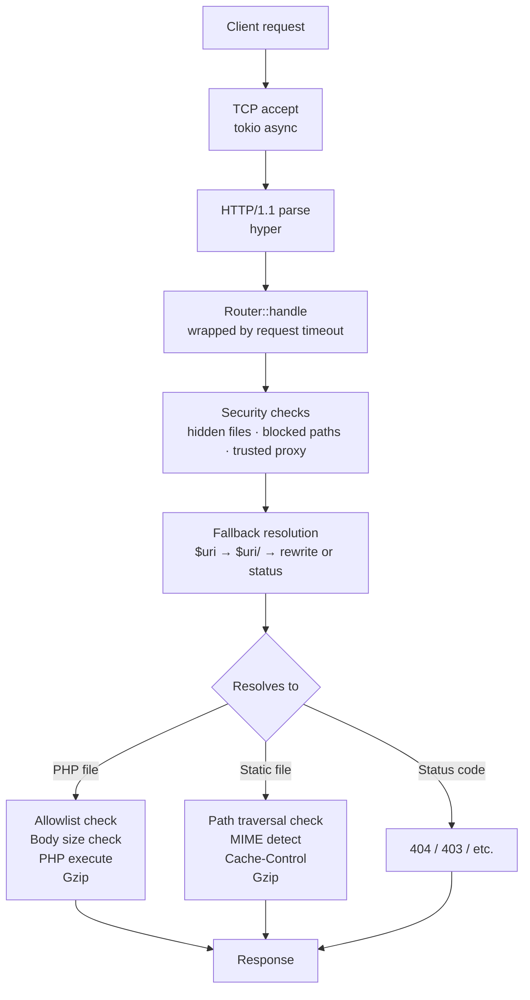

# HTTP Server Architecture

This document covers the HTTP server design, PHP execution model, request lifecycle, and configuration system.

---

## Request Lifecycle



## PHP Execution Model

### Request Reuse

The embed SAPI starts a single PHP request during `php_embed_init()`. Instead of calling `php_request_shutdown()` / `php_request_startup()` per HTTP request (which crashes in the embed SAPI), we reuse that initial request and manually reset state between requests.

Per-request reset:
1. Clear output buffer and response headers
2. Reset `SG(read_post_bytes) = -1` so PHP re-reads POST data
3. Close and recreate `request_body` stream for fresh `php://input`
4. Destroy all `PG(http_globals)` arrays (stale superglobals)
5. Rebuild `$_SERVER`, `$_GET`, `$_POST`, `$_FILES`, `$_COOKIE`, `$_REQUEST`

### Superglobal Population

| Variable | Source |
|----------|--------|
| `$_SERVER` | Built by Rust (`PhpRequest::server_variables()`), registered via C callback |
| `$_GET` | Parsed from query string via `sapi_module.treat_data(PARSE_STRING, ...)` |
| `$_POST` | `sapi_handle_post()` — dispatches to content-type-specific parser |
| `$_FILES` | Populated by `sapi_handle_post()` for multipart/form-data (rfc1867) |
| `$_COOKIE` | Manual parsing of `Cookie` header (`key=value; key=value`) |
| `$_REQUEST` | Merge of `$_GET` + `$_POST` + `$_COOKIE` |

### `$_SERVER` Variables

Key distinction after fallback rewrites (e.g. `/blog/hello` -> `/index.php`):

| Variable | Value | Description |
|----------|-------|-------------|
| `REQUEST_URI` | `/blog/hello` | Original URI from client |
| `SCRIPT_NAME` | `/index.php` | Resolved script (relative to docroot) |
| `SCRIPT_FILENAME` | `/var/www/html/index.php` | Absolute path to script |
| `PHP_SELF` | `/index.php` | Same as `SCRIPT_NAME` |
| `DOCUMENT_ROOT` | `/var/www/html` | Document root |
| `QUERY_STRING` | `preview=true` | Without leading `?` |
| `GATEWAY_INTERFACE` | `CGI/1.1` | Required by many PHP apps |
| `REDIRECT_STATUS` | `200` | Required by some PHP apps |

HTTP headers are mapped to `HTTP_*` variables, except `Content-Type` -> `CONTENT_TYPE` and `Content-Length` -> `CONTENT_LENGTH` (no `HTTP_` prefix per CGI spec).

### Thread Safety

PHP is compiled with ZTS (Zend Thread Safety). Each `spawn_blocking` thread auto-registers with TSRM on first use, getting its own isolated PHP context. Multiple PHP requests execute concurrently. The `Mutex<Option<PhpRuntime>>` only protects one-time init/shutdown, not request execution. Windows builds use NTS with serialized execution via mutex.

### Signal Handling

PHP installs a `SIGPROF` handler for `max_execution_time`. This signal is process-wide and would crash tokio worker threads (NULL dereference in PHP's handler on non-PHP threads). We override PHP's signal functions with no-ops via `--wrap` linker flags and manage timeouts at the HTTP layer instead.

### Bailout Protection

PHP uses `setjmp`/`longjmp` for error handling. All PHP calls go through `ephpm_wrapper.c` which wraps execution in `zend_try`/`zend_catch`. PHP 8.x `exit()`/`die()` throws an unwind exit exception, which we detect and treat as a normal response (with captured output).

## SAPI Callbacks

| Callback | Purpose |
|----------|---------|
| `ub_write` | Captures PHP output into a growable buffer |
| `read_post` | Feeds POST body from Rust to PHP |
| `read_cookies` | Returns raw Cookie header string |
| `register_server_variables` | Populates `$_SERVER` from Rust-provided key/value pairs |
| `send_headers` | No-op (headers captured separately after execution) |
| `log_message` | Routes PHP errors to stderr |

### Response Header Capture

After script execution, headers are read from `SG(sapi_headers).headers`. If no explicit `Content-Type` was set by PHP (e.g. `phpinfo()` relies on the default), we synthesize one from `SG(sapi_headers).mimetype` or PHP's `default_mimetype`/`default_charset` settings.

## Server Setup

### Initialization Sequence

PHP must be initialized **before** the tokio runtime to avoid signal conflicts:

```
1. Parse CLI args + load config        (single-threaded)
2. Init tracing with configured level  (single-threaded)
3. Init PHP runtime                    (single-threaded)
   - php_embed_init()
   - ephpm_install_sapi()
   - ephpm_apply_ini_settings()
   - ephpm_finalize_for_http()
4. Create tokio runtime                (spawns worker threads)
5. Run HTTP server
6. Shutdown PHP runtime
```

### Hyper Connection Settings

| Setting | Source | Purpose |
|---------|--------|---------|
| `keep_alive(true)` | hardcoded | HTTP/1.1 persistent connections |
| `header_read_timeout` | `server.timeouts.header_read` | Slow client header protection |
| `max_buf_size` | `server.request.max_header_size` | Header size limit |
| Timer | `TokioTimer` | Required for timeout functionality |

## Static File Serving

- MIME type detection via `mime_guess` (file extension based)
- Path traversal protection via `canonicalize()` + prefix check
- Gzip compression for compressible content types above minimum size
- `Cache-Control` header when configured
- `ETag` generation (weak, hash-based) + `If-None-Match` → 304 Not Modified

## PHP Response Cache (Phase 2 — requires KV store)

The static file `ETag` support only covers non-PHP assets. PHP frameworks (WordPress, Laravel) generate their own `ETag` headers for dynamic content, but every request still hits PHP to compute whether the content changed. With the clustered KV store, we can intercept PHP-generated ETags and short-circuit repeat requests across all nodes without executing PHP at all.

### Flow

```
1. First request: /blog/hello
   → PHP executes, returns response with ETag: "abc123"
   → Server stores in KV: cache:<url_key> → { etag: "abc123", headers, body }
   → Response sent to client

2. Repeat request: /blog/hello + If-None-Match: "abc123"
   → Server checks KV for cache:<url_key>
   → ETag matches → return 304 Not Modified immediately
   → No PHP execution, no mutex contention

3. Works across all nodes via gossip replication
```

### Design Decisions

| Decision | Options | Notes |
|----------|---------|-------|
| **Cache key** | URL alone vs URL + vary headers (cookies, auth) | Must not serve cached authenticated pages to anonymous users. WordPress sets different cookies for logged-in users — key should include a cookie-based cache group or skip caching entirely when auth cookies are present. |
| **Invalidation** | TTL, purge header, PHP hook | TTL is simplest. A `X-Ephpm-Cache-Purge` response header from PHP could signal immediate invalidation. For WordPress, a must-use plugin could call a purge endpoint on content updates. |
| **Storage scope** | ETag-only (304s) vs full response (edge cache) | ETag-only saves KV space but still requires PHP on cache miss. Full response storage turns ephpm into an edge cache — much bigger win but needs memory/eviction policy. Start with full response. |
| **Cache bypass** | `Cache-Control: no-cache`, `no-store`, `private` | Respect standard HTTP cache directives from PHP. Never cache responses with `Set-Cookie` or `private`. |

### Impact

This is a significant performance multiplier for PHP applications. Most WordPress page views are anonymous and return identical content. Skipping PHP entirely for repeat visitors eliminates the single-threaded PHP mutex bottleneck and lets the async HTTP server handle cached responses at full throughput across all nodes.

## TLS

Manual TLS via `rustls` (pure Rust, no OpenSSL dependency). Certificate and key loaded from PEM files at startup.

### Modes

| Config | Behavior |
|--------|----------|
| No `[server.tls]` | Plain HTTP on `server.listen` (default) |
| `tls.cert` + `tls.key` only | HTTPS on `server.listen`, no HTTP listener |
| `tls.cert` + `tls.key` + `tls.listen` | HTTPS on `tls.listen`, HTTP on `server.listen` |
| + `tls.redirect_http = true` | HTTP listener sends 301 redirects to HTTPS |

### Connection Flow (TLS)

```
TCP Accept → TLS Handshake (tokio-rustls) → HTTP/1.1 Parse → Router
                  ↓ timeout
         header_read_timeout
```

- TLS handshake timeout reuses `server.timeouts.header_read` (default 30s)
- ALPN negotiated to `http/1.1` only
- `is_tls` flag propagated to router so `$_SERVER['HTTPS']` is set correctly
- When behind a trusted proxy, `X-Forwarded-Proto` takes precedence over native TLS status

### Automatic TLS (ACME)

Zero-config HTTPS via Let's Encrypt, like Caddy. Uses `rustls-acme` crate with TLS-ALPN-01 challenge (works on port 443 alone, no port 80 needed).

**Single-node** (implemented): `DirCache` stores certs on the filesystem. On startup, requests a cert from Let's Encrypt (~5-30s), then hot-swaps on renewal. No restarts needed. Uses `LazyConfigAcceptor` to inspect each TLS `ClientHello` — ACME challenges are handled inline, normal connections pass through to hyper.

**Renewal timing**: `rustls-acme` renews at 2/3 of remaining certificate validity (~30 days before expiry for standard 90-day Let's Encrypt certs). This is hardcoded in the library — there is no API to configure it. If we need customizable renewal timing in the future (e.g., for shorter-lived certs or different CAs), options are: contribute the feature upstream to `rustls-acme`, or switch to `instant-acme` which gives full control over the ACME flow at the cost of managing renewal scheduling ourselves.

```toml
[server.tls]
domains = ["example.com", "www.example.com"]
email = "admin@example.com"
cache_dir = "/var/lib/ephpm/certs"
# staging = true  # use for testing to avoid rate limits
```

**Clustered** (Phase 2 — requires KV store and gossip): In a multi-node deployment, naive ACME creates several problems that the clustered KV store solves:

| Problem | What happens | Solution |
|---------|-------------|----------|
| **Renewal stampede** | N nodes all try to renew simultaneously, hitting Let's Encrypt rate limits (50 certs/domain/week) | Distributed lock via KV (`acme:lock:<domain>` key with TTL). One node wins, renews, others wait. |
| **Challenge routing** | Let's Encrypt connects to the domain, DNS round-robins to any node, but only the initiating node has the challenge token | Share challenge tokens via KV (`acme:challenge:<token>` keys). Any node can respond. |
| **Cert distribution** | After one node obtains the cert, all nodes need it immediately | Store cert in KV (`certs:<domain>` key), replicate via gossip. All nodes pick it up. |
| **Leader election** | Only one node should drive renewals to avoid redundant work | KV-based leader (`acme:leader` key with TTL heartbeat). Leader renews, followers watch. |

The `rustls-acme` crate has a pluggable `Cache` trait — swap `DirCache` for a `KvCache` implementation when clustering is built. Zero changes to the ACME logic itself.

```
Phase 1 (single-node):  AcmeConfig → DirCache (filesystem)
Phase 2 (clustered):    AcmeConfig → KvCache (gossip-replicated KV store)
```

## Compression

Applied to both PHP and static responses when the client sends `Accept-Encoding: gzip`.

| Check | Condition |
|-------|-----------|
| Enabled | `server.response.compression = true` |
| Min size | Response body >= `server.response.compression_min_size` |
| Content type | `text/*`, `*javascript`, `*json`, `*xml`, `*svg` |
| Smaller | Compressed size < original size |

Level controlled by `server.response.compression_level` (1=fast, 9=best).

## Security Layers

Evaluated in order for every request:

1. **Hidden files** — Paths with dot-prefixed segments (`.env`, `.git`, `.htaccess`) are blocked based on `server.static.hidden_files` (`deny`=403, `ignore`=404, `allow`=pass).

2. **Blocked paths** — URI matched against `server.security.blocked_paths` glob patterns. Any match returns 403. Supports `*` wildcards (`/vendor/*`, `/wp-config.php`).

3. **PHP allowlist** — When `server.security.allowed_php_paths` is non-empty, only matching PHP files execute. Others get 403. Prevents arbitrary PHP execution in upload directories.

4. **Body size limit** — `Content-Length` checked against `server.request.max_body_size` before reading the body. Returns 413.

5. **Path traversal** — Static file paths canonicalized and verified within document root.

### Trusted Proxy Resolution

When `server.security.trusted_proxies` contains CIDR ranges and the connecting IP matches:
- `X-Forwarded-For` is parsed right-to-left, returning the first untrusted IP as `REMOTE_ADDR`
- `X-Forwarded-Proto: https` sets `$_SERVER['HTTPS'] = 'on'`

## Fallback Resolution

Nginx-style `try_files` implemented as a configurable `fallback` chain:

```toml
fallback = ["$uri", "$uri/", "/index.php?$query_string"]
```

- Variables: `$uri` (request path), `$query_string` (raw query string)
- Entries ending with `/` check for directory + index files
- Last entry is the fallback: either a rewrite target or `=NNN` status code
- For static-only sites: `["$uri", "$uri/", "=404"]`

---

## Configuration Reference

### Implemented

| Config | Type | Default | Description |
|--------|------|---------|-------------|
| `server.listen` | string | `"0.0.0.0:8080"` | Bind address |
| `server.document_root` | path | `"."` | Document root directory |
| `server.index_files` | string[] | `["index.php", "index.html"]` | Index file names |
| `server.fallback` | string[] | `["$uri", "$uri/", "/index.php?$query_string"]` | URL resolution chain |
| `server.request.max_body_size` | int | `10485760` (10 MiB) | Max request body (0=unlimited) |
| `server.request.max_header_size` | int | `8192` (8 KiB) | Max header buffer size |
| `server.timeouts.header_read` | int | `30` | Seconds to receive headers |
| `server.timeouts.idle` | int | `60` | Idle connection timeout (seconds) |
| `server.timeouts.request` | int | `300` | Total request timeout (seconds) |
| `server.response.compression` | bool | `true` | Enable gzip compression |
| `server.response.compression_level` | int | `1` | Gzip level (1-9) |
| `server.response.compression_min_size` | int | `1024` | Min bytes to compress |
| `server.response.headers` | [string, string][] | `[]` | Custom response headers (CORS, CSP, HSTS) |
| `server.static.cache_control` | string | `""` | Cache-Control header for static files |
| `server.static.hidden_files` | string | `"deny"` | Dotfile handling: deny, ignore, allow |
| `server.static.etag` | bool | `true` | `ETag` headers + 304 Not Modified support |
| `server.request.trusted_hosts` | string[] | `[]` | Host header validation (421 if no match) |
| `server.security.trusted_proxies` | string[] | `[]` | CIDR ranges for proxy trust |
| `server.security.blocked_paths` | string[] | `[]` | Glob patterns to block (403) |
| `server.security.allowed_php_paths` | string[] | `[]` | PHP execution allowlist |
| `server.logging.level` | string | `"info"` | Log level (trace/debug/info/warn/error) |
| `server.logging.access` | string | `""` | Access log file path |
| `server.tls.cert` | path | — | PEM certificate chain file (enables HTTPS) |
| `server.tls.key` | path | — | PEM private key file |
| `server.tls.listen` | string | — | Separate HTTPS listen address |
| `server.tls.redirect_http` | bool | `false` | 301 redirect HTTP to HTTPS |
| `server.tls.domains` | string[] | `[]` | Domain names for ACME auto-TLS |
| `server.tls.email` | string | — | Contact email for ACME registration |
| `server.tls.cache_dir` | path | `"certs"` | ACME certificate cache directory |
| `server.tls.staging` | bool | `false` | Use Let's Encrypt staging environment |
| `php.max_execution_time` | int | `30` | PHP per-request timeout (seconds) |
| `php.memory_limit` | string | `"128M"` | PHP memory limit |
| `php.ini_overrides` | [string, string][] | `[]` | INI directive overrides |

### CLI Flags

| Flag | Scope | Description |
|------|-------|-------------|
| `-c, --config` | serve | Config file path (default: `ephpm.toml`) |
| `-l, --listen` | serve | Listen address (overrides config) |
| `-d, --document-root` | serve | Document root (overrides config) |
| `-v` | serve | Debug logging (`-vv` for trace) |

Precedence: `RUST_LOG` env var > `-v` flag > `server.logging.level` > `"info"`

### Environment Variables

All config values can be overridden with `EPHPM_`-prefixed environment variables using `__` as the nesting separator:

```bash
EPHPM_SERVER__LISTEN=0.0.0.0:9090
EPHPM_SERVER__TIMEOUTS__IDLE=120
EPHPM_PHP__MEMORY_LIMIT=256M
```

### Roadmap

| Config | Description | Priority |
|--------|-------------|----------|
| `server.graceful_shutdown_timeout` | How long to wait for in-flight requests on SIGTERM | Medium |
| `server.static.expires` | Per-extension cache lifetimes (e.g., images 1yr, CSS 1wk) | Medium |
| `server.static.index_fallback` | Serve `index.html` for SPA routes (distinct from PHP fallback) | Medium |
| `server.response.server_header` | Custom or disabled `Server:` header (fingerprinting prevention) | Low |
| `server.request.max_uri_length` | Reject abnormally long URIs (defense in depth) | Low |
| `server.worker_threads` | Tokio worker thread count (auto-detect by default) | Low |
| `server.security.rate_limit` | Basic per-IP rate limiting | Low |
| `server.metrics.enabled` | Prometheus metrics endpoint | Medium |
| `server.rewrites` | Regex-based URL rewriting | Low |
| `server.logging.format` | Text vs JSON structured logging | Low |
| `server.logging.access_format` | Common/combined access log format | Low |
| `php.env` | Environment variables passed to PHP (12-factor app support) | Medium |
| `php.disable_functions` | Shortcut for INI directive | Low |
| `php.error_log` | Separate PHP error log path | Low |
